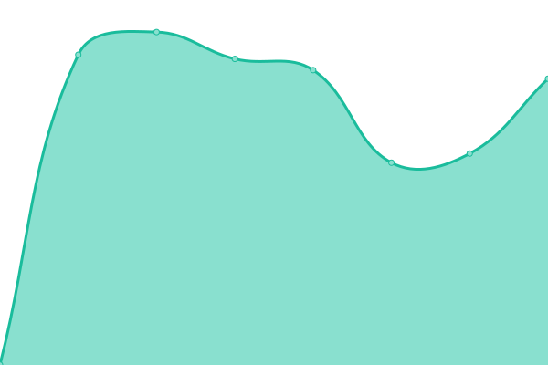
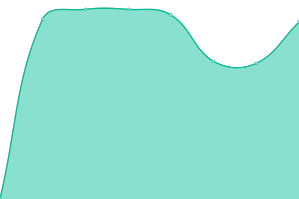

# [📈 Live Status](https://upptime.seameosen.edu.my): <!--live status--> **🟩 All systems operational**

This repository contains the open-source uptime monitor and status page for [SEAMEO SEN](seameosen.edu.my), powered by [Upptime](https://github.com/upptime/upptime).

With [Upptime](https://upptime.js.org), you can get your own unlimited and free uptime monitor and status page, powered entirely by a GitHub repository. We use [Issues](https://github.com/SEAMEO-SEN/upptime/issues) as incident reports, [Actions](https://github.com/SEAMEO-SEN/upptime/actions) as uptime monitors, and [Pages](https://upptime.seameosen.edu.my) for the status page.

<!--start: status pages-->
<!-- This summary is generated by Upptime (https://github.com/upptime/upptime) -->
<!-- Do not edit this manually, your changes will be overwritten -->
<!-- prettier-ignore -->
| URL | Status | History | Response Time | Uptime |
| --- | ------ | ------- | ------------- | ------ |
|  [Main Site](https://seameosen.edu.my) | 🟩 Up | [main-site.yml](https://github.com/SEAMEO-SEN/upptime/commits/HEAD/history/main-site.yml) | 

 458ms
     
 | 

<a href="https://upptime.seameosen.edu.my/history/main-site">100.00%</a>
    

|  [International Conference on Special Education Site](https://icse.seameosen.edu.my) | 🟩 Up | [international-conference-on-special-education-site.yml](https://github.com/SEAMEO-SEN/upptime/commits/HEAD/history/international-conference-on-special-education-site.yml) | 

 953ms
     
 | 

<a href="https://upptime.seameosen.edu.my/history/international-conference-on-special-education-site">100.00%</a>
    

|  [Innovation for Disability-Inclusive Education Competition](https://idiec.seameosen.edu.my) | 🟩 Up | [innovation-for-disability-inclusive-education-competition.yml](https://github.com/SEAMEO-SEN/upptime/commits/HEAD/history/innovation-for-disability-inclusive-education-competition.yml) | 

 974ms
     
 | 

<a href="https://upptime.seameosen.edu.my/history/innovation-for-disability-inclusive-education-competition">100.00%</a>
    

|  [SEAMEO SEN Library](https://library.seameosen.edu.my) | 🟩 Up | [seameo-sen-library.yml](https://github.com/SEAMEO-SEN/upptime/commits/HEAD/history/seameo-sen-library.yml) | 

 1215ms
     
 | 

<a href="https://upptime.seameosen.edu.my/history/seameo-sen-library">100.00%</a>
    

|  [SEAMEO SEN Publication](https://publication.seameosen.edu.my) | 🟩 Up | [seameo-sen-publication.yml](https://github.com/SEAMEO-SEN/upptime/commits/HEAD/history/seameo-sen-publication.yml) | 

 844ms
     
 | 

<a href="https://upptime.seameosen.edu.my/history/seameo-sen-publication">100.00%</a>
    

|  [SEAMEO SEN Integrated Excellence System](https://sies.seameosen.edu.my) | 🟩 Up | [seameo-sen-integrated-excellence-system.yml](https://github.com/SEAMEO-SEN/upptime/commits/HEAD/history/seameo-sen-integrated-excellence-system.yml) | 

 1002ms
     
 | 

<a href="https://upptime.seameosen.edu.my/history/seameo-sen-integrated-excellence-system">100.00%</a>
    

|  [SEAMEO SEN Onestop Management System](https://onestop.seameosen.edu.my) | 🟩 Up | [seameo-sen-onestop-management-system.yml](https://github.com/SEAMEO-SEN/upptime/commits/HEAD/history/seameo-sen-onestop-management-system.yml) | 

 1469ms
     
 | 

<a href="https://upptime.seameosen.edu.my/history/seameo-sen-onestop-management-system">100.00%</a>
    

<!--end: status pages-->

[**Visit our status website →**](https://upptime.seameosen.edu.my)

## 📄 License

- Powered by: [Upptime](https://github.com/upptime/upptime)
- Code: [MIT](./LICENSE) © [SEAMEO SEN](seameosen.edu.my)
- Data in the `./history` directory: [Open Database License](https://opendatacommons.org/licenses/odbl/1-0/)
